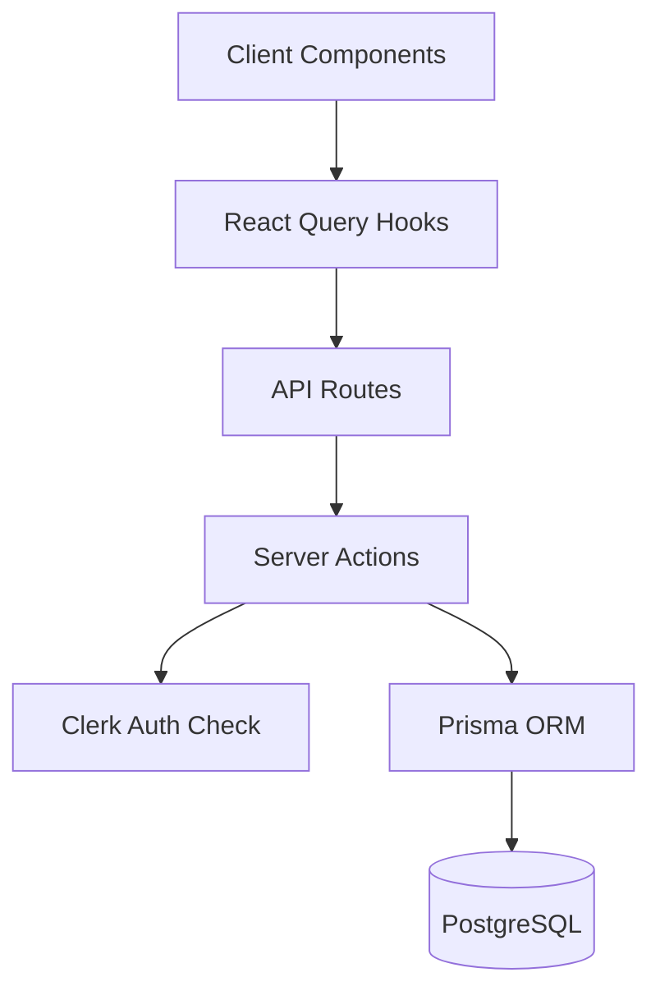

# Workout Timer

[](LICENSE)
[](https://nextjs.org/)
[](https://www.typescriptlang.org/)

Full-stack workout timer: AI-generated workouts, drag-and-drop builder, real-time playback. Next.js 15, TypeScript, PostgreSQL, Vercel.

**[Live Demo](https://loop-timer.vercel.app)**

## Features

- Custom intervals, loops, rest periods; drag-and-drop builder
- AI workout generation (Groq), template library, export/import, share links + QR
- Clerk auth (Google, GitHub, email); React Query; PWA; dark/light; accessibility

## Tech stack

Next.js 15 (App Router, Server Components, Server Actions), TypeScript 5.8, Tailwind + shadcn/ui, Prisma, PostgreSQL (Docker/Neon), Clerk, Groq. Jest + Playwright, Vercel.

## Architecture



Data flow: UI → hooks → API routes → server actions (auth + validation) → Prisma → PostgreSQL. Server Actions for mutations; React Query for cache; Zod at boundaries.

## Prerequisites

- Node.js 20+
- Docker (local PostgreSQL)

## Install and run

```bash
git clone <repo> && cd timer
npm install
docker compose up -d
cp env.example .env
npm run db:migrate
npm run dev
```

Open [http://localhost:3000](http://localhost:3000).

## Scripts

| Area      | Command                                                                                                                       |
| --------- | ----------------------------------------------------------------------------------------------------------------------------- |
| Dev       | `npm run dev` — dev server (starts Docker + Next.js); `npm run dev:db` — DB only; `npm run npmi:clean` — clean install        |
| Build     | `npm run build`, `npm run start`, `npm run vercel-build`                                                                      |
| Test      | `npm test`, `npm run test:watch`, `npm run test:coverage`, `npm run test:e2e`, `npm run test:db`                              |
| Lint      | `npm run lint`, `npm run lint:fix`, `npm run format`, `npm run format:check`                                                  |
| AI rules  | `npm run sync:ai-rules` — sync `.ai-rules/*.md` into `.cursor/rules/` for Cursor                                              |
| DB (dev)  | `npm run db:migrate`, `npm run db:migrate:reset` (destructive), `npm run db:generate`, `npm run db:studio`, `npm run db:seed` |
| DB (prod) | `npm run db:migrate:deploy`, `npm run db:migrate:deploy:prod`                                                                 |
| Docker    | `npm run db:up`, `npm run db:down`                                                                                            |
| Deploy    | `npm run deploy`, `npm run vercel:deploy`, `npm run vercel:env:pull:prod`                                                     |

## Environment

Copy `env.example` to `.env`. Required:

- **Database**: `DATABASE_URL` (pooled), `DIRECT_URL` (direct) — see Neon docs; use `?sslmode=require`
- **Clerk**: `NEXT_PUBLIC_CLERK_PUBLISHABLE_KEY`, `CLERK_SECRET_KEY`, `CLERK_WEBHOOK_SECRET`
- **AI**: `GROQ_API_KEY`

Never commit `.env*`; use `env.example` as template.

## Database

- **Local**: Docker + `npm run db:migrate` + `npm run db:seed`. Stop: `npm run db:down`.
- **Production**: Neon; set `DATABASE_URL` and `DIRECT_URL` in Vercel. Deploy runs migrations and seed automatically.

## Project structure

```
app/          # Routes, layout, API (thin controllers)
components/   # Feature-first (ui/, providers/, layout/, timers/, clock/)
actions/      # Server actions (DB, auth)
hooks/        # React Query, timer state
lib/          # Constants, timer-tree, navigation, sound
prisma/       # Schema, migrations, seed
schema/       # Zod (API/form boundaries)
types/        # Domain types, guards
utils/        # Pure helpers (no app deps)
```

## License and author

Copyright © 2025 Bálint Deák. All Rights Reserved. Proprietary; see [LICENSE](LICENSE). Budapest, Hungary.
