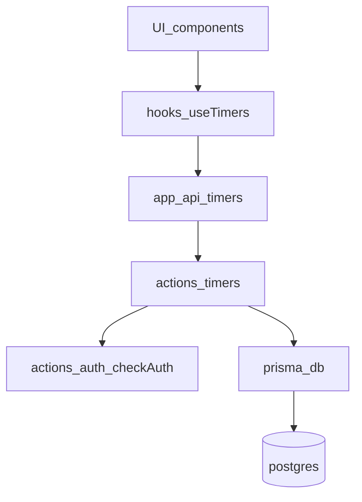

# Data flow

## High-level flow

Timer data flows through the app in a layered way:

1. **UI** (`components/`, `app/`) calls **hooks**
2. **Hooks** (`hooks/use-timers.ts`) call **API routes** (`app/api/timers/*`)
3. **API routes** call **server actions** (`actions/timers/*`)
4. **Server actions** enforce auth + ownership and call **Prisma** (`prisma/`)

## Auth boundary

- **Client**: never treated as trusted.
- **Server actions**: call `checkAuth()` before reading/mutating data.
- **API routes**: should remain thin, use actions, and return consistent status codes.

## Validation boundary

- **Inputs** from clients are validated with Zod at boundaries:
  - API route body parsing
  - server action inputs (where relevant)
  - forms (client-side) when implemented

## Caching and invalidation

- React Query keys are centralized in `lib/constants/query-keys.ts`.
- Mutations invalidate relevant query keys after create/update/delete:
  - `QUERY_KEYS.TIMERS` for timer mutations
  - `QUERY_KEYS.TEMPLATES` for template mutations
  - `QUERY_KEYS.SHARED_TIMERS` for shared timer operations

## Custom events

- Cross-component timer running state is broadcast via `CUSTOM_EVENTS.TIMER_STATE_CHANGE` (`lib/constants/custom-events.ts`).
